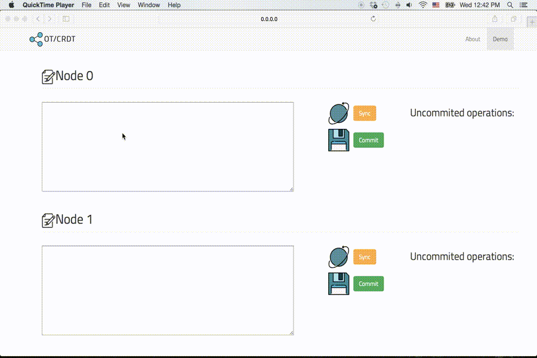

# A-Tour-of-Colleberative-Editing
Collaborative Editing: Concepts behind the scene and a simple demo

## Design
We use a simple list-based CRDT to implement collaborate editor, please go to `/CRDT` folder for more information.

We assume end users are talking to two data centers and there is a network partition. **Commit** means the replica is pushing operations to other replicas. **Sync** means the replica is receiving updates from other replicas. The system is not real-time, each step requires a click.

Will make sure:
* Eventual delivery
* No conflict
* Lossless

### TODO
* Implement selection a range inside the editor (batch deletion)
* Support undo/redo in each replica
* Support other languages rather than English

### Demo
For live demo, please play [here](http://starryvm.westus.cloudapp.azure.com:8000/)



### Future Work
My initial design was to utilize user system and make people really collaborate over browsers. According to the limited time for this project, I compromised and only implemented a naive demo with two editors inside.

### Credits:
- Huge thanks to [Aqua](https://github.com/jedireza/aqua) for boilerplate.
- [Freepik](http://www.flaticon.com/authors/freepik), [Madebyoliver](http://www.flaticon.com/authors/madebyoliver) for free Icon.

## Dev Usage
### Requirements

- [Node.js](http://nodejs.org/download/)
- [MongoDB](http://www.mongodb.org/downloads)
- [`bcrypt`](https://github.com/ncb000gt/node.bcrypt.js)

### Installation

```bash
$ npm install
```
### First time setup

```bash
$ npm run first-time-setup
```

### Run

```bash
$ npm start
```

Point your browser to http://127.0.0.1:8000/.

[`nodemon`](https://github.com/remy/nodemon) watches for changes in server code
and restarts the app automatically. [`gulp`](https://github.com/gulpjs/gulp) and
[`webpack`](https://github.com/webpack/webpack) watch the front-end files and
re-build those automatically too.

### Running in production

```bash
$ node server.js
```

Use `forever` to run the application in background!
```bash
$ npm install -g forever
$ forever start server.js
```

This doesn't watch for file changes. Also be sure to set
these environment variables in your production environment:

 - `NODE_ENV=production` - This is important for many different optimizations,
   both server-side and with the front-end build files.
 - `NPM_CONFIG_PRODUCTION=false` - This tells `$ npm install` to not skip
   installing `devDependencies`, which we need to build the front-end files.
